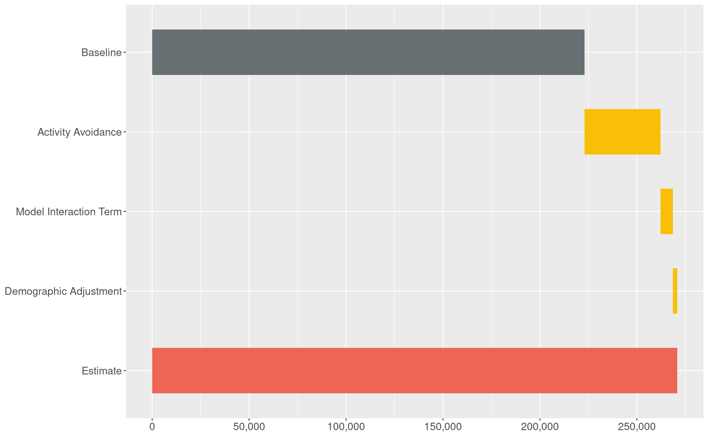
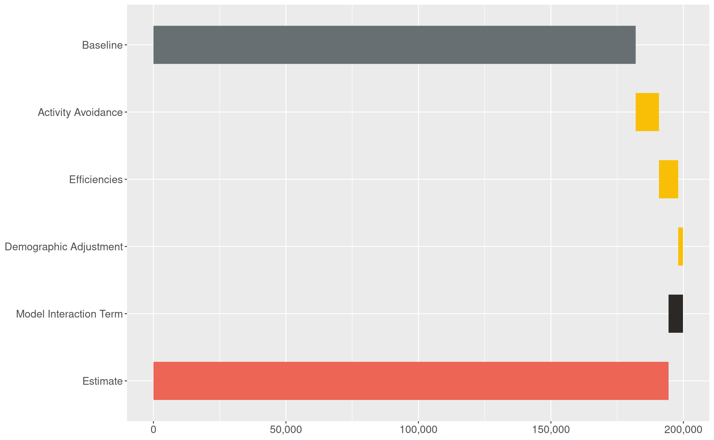
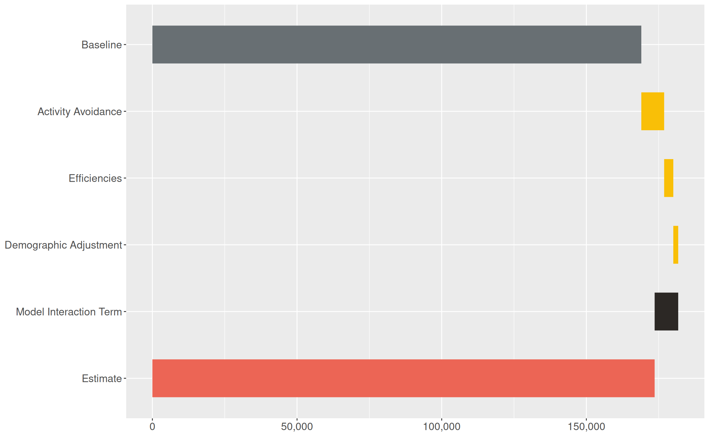
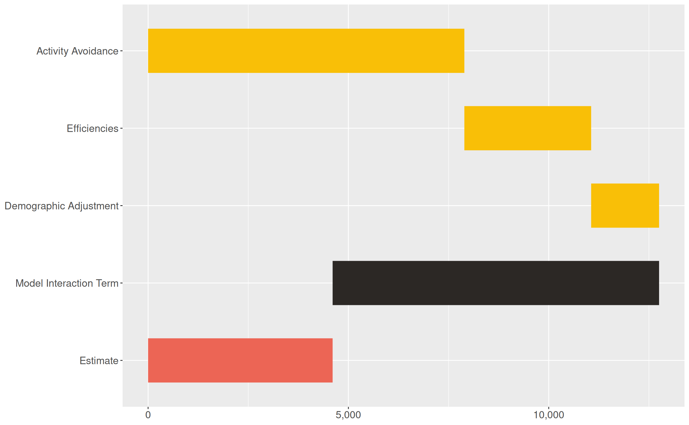
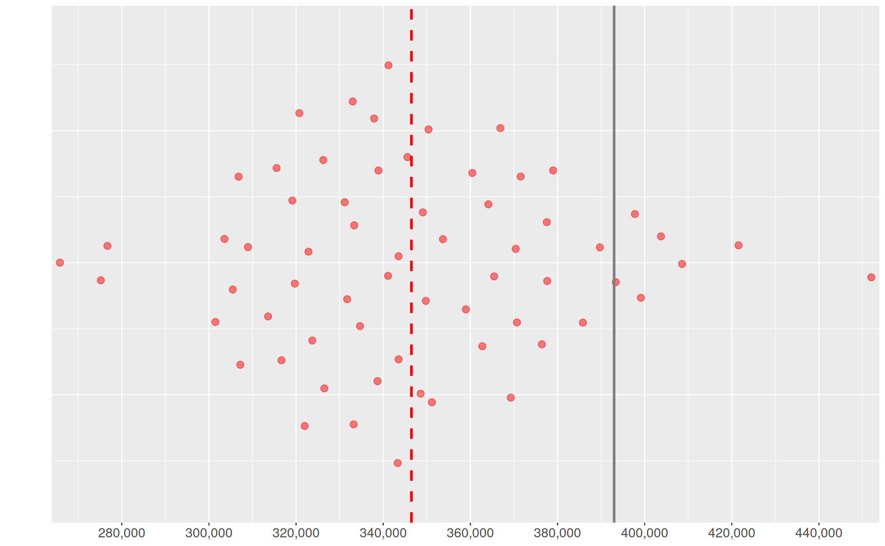
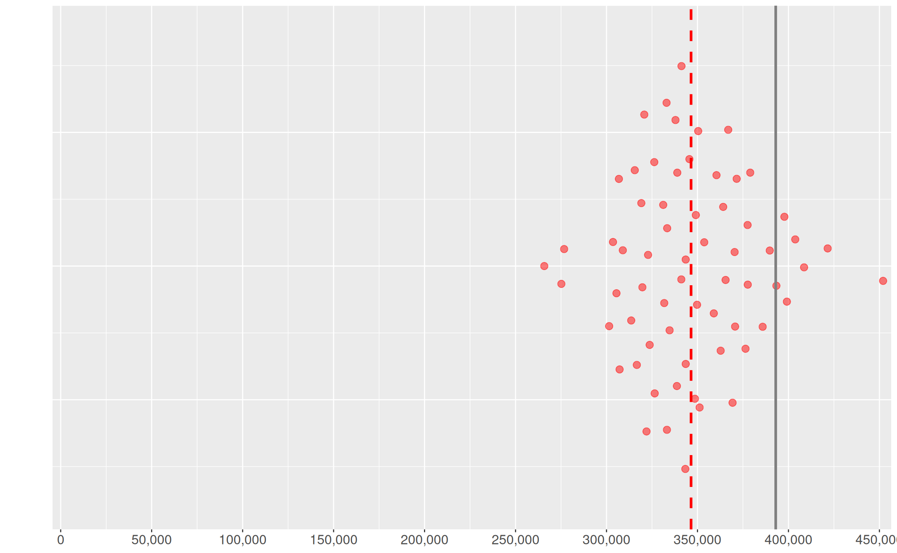
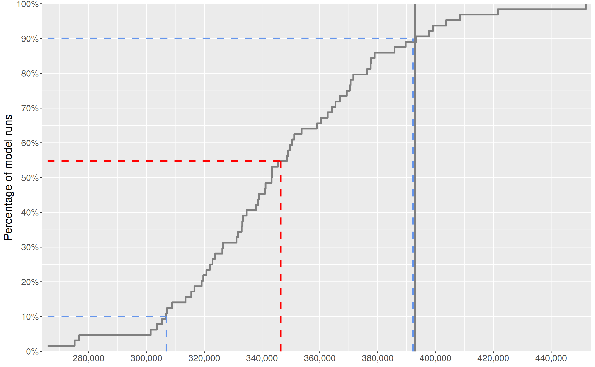
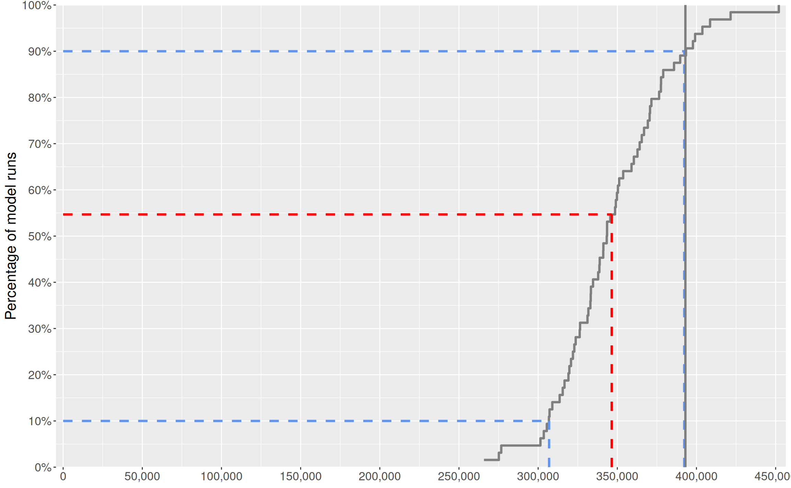

# Plots and tables with reskit

The aims of this vignette are to:

- illustrate usage patterns of some of the functions in {reskit}
- provide a set of test/example outputs of tables and charts derived
  from NHP demand model results data.

The latter may be visually compared to / validated against
visualisations currently produced by the NHP Outputs app.

Firstly we load the functions in the {reskit} package.

Code

``` r

# library(reskit)
purrr::walk(dir(here::here("R"), full.names = TRUE), source)
seed <- 1871
```

Then we create a fake `results` object which consists of synthetic data
created by some internal reskit functions. It ought to go without saying
that the numbers in these synthetic tables are entirely fictitious and
unrealistic. They exist purely to provide a test basis for the data
processing and visualisation functions in this package.

This is so we don’t have to go and read in actual data for the sake of
this vignette.

In real life however you would do something a bit like the steps in the
next little section…

## Example using azkit and reskit to download results

Here is an example of some code that you might use to access results
data from Azure storage. (We’re not running it here, it’s just provided
as an example.)

``` r

token <- azkit::get_auth_token()
results_container <- azkit::get_container(
  Sys.getenv("AZ_RESULTS_CONTAINER"),
  token = token
)

# use various filters to get the right dataset (PartitionKey), model version and
# scenario from a runs lookup table
results_path <- azkit::read_azure_table(
  Sys.getenv("AZ_RUNS_TABLE"),
  token = token,
  filter = "PartitionKey eq 'national' and app_version eq 'v5.1'",
  select = "aggregated_results_path"
) |>
  dplyr::pull("aggregated_results_path") |>
  grepv(pattern = "NDG2\\-zero") |>
  dplyr::first() # ensure we only get 1 path!

results <- read_results_parquet_files(results_container, results_path)
```

## Back to our synthetic results data

OK so back in vignette world (worst theme park ever), let’s use reskit’s
experimental `create_demo*` functions to create some fake results data.

Code

``` r

default_tbl <- create_demo_default_tbl(seed)
tretspef_losgroup_tbl <- create_demo_tretspef_losgroup_tbl(seed)
sex_agegroup_tbl <- create_demo_sex_agegroup_tbl(seed)
sex_tretspef_tbl <- create_demo_sex_tretspef_tbl(seed)
stepcounts_tbl <- create_demo_stepcounts_tbl(seed)

# fmt: skip
tbl_names <- c(
  "default", "tretspef+los_group", "sex+age_group",
  "sex+tretspef_grouped", "step_counts"
)

results <- list(
  default_tbl,
  tretspef_losgroup_tbl,
  sex_agegroup_tbl,
  sex_tretspef_tbl,
  stepcounts_tbl
) |>
  rlang::set_names(tbl_names)
```

We now have a real `results` object (an R list) to work with for the
remainder of the vignette.

## Moving on to the outputs (tables and charts)

Having shown one way of accessing the results parquet files, this
vignette now runs through the suggested pipelines of functions that
generate the NHP Outputs app tables and charts, which usually comprise
in their simplest form:

- a data preparation function which creates a data frame ready to be
  used by:
- a visualisation function that creates a table or chart.

Some data preparation functions have sub-functions that may occsaionally
be useful; there are also `export*` functions designed to create csv
versions of prepared results data (in the same form as the data used by
the visualisation function, but with all sites, measures, activity types
etc included.)

## Outputs: tables

### “Main summary table” - overall change by Point of Delivery

This uses the “default” table (from `default.parquet`), passing it to
the `compile_principal_pod_data` function which prepares the data for
the table.

The only relevant filter here is for site selection.

Then the `make_principal_pod_table` function generates the table.

Code

``` r

results |>
  compile_principal_pod_data() |>
  make_principal_pod_table()
```

[TABLE]

Now the same thing again but testing the site selection feature. We
should get a similar style table but with smaller numbers as we have
filtered down to just one site.

Code

``` r

results |>
  compile_principal_pod_data(sites = "site1") |>
  make_principal_pod_table()
```

[TABLE]

### The principal LoS table

This uses data from the “tretspef+los_group” results table.

With `measure` set to “beddays”:

Code

``` r

results |>
  compile_principal_los_data(measure = "beddays") |>
  make_principal_los_table()
```

[TABLE]

With `measure` set to “admissions”:

Code

``` r

results |>
  compile_principal_los_data(measure = "admissions", sites = "site2") |>
  make_principal_los_table()
```

[TABLE]

## Outputs: charts

### Impact of changes charts

For these we need to use carefully chosen combinations of measure,
activity type, and pod.

#### Overall (“waterfall”) chart with baseline

As this is for admissions, “efficiencies” should not be shown on the
y-axis.

Code

``` r

results |>
  compile_change_factor_data(
    measure = "admissions",
    activity_type = "ip",
    pods = c(
      "ip_elective_admission",
      "ip_maternity_admission",
      "ip_non-elective_admission"
    ),
    include_baseline = TRUE
  ) |>
  make_overall_cf_plot()
```



Code

``` r

results |>
  compile_change_factor_data(
    measure = "beddays",
    activity_type = "ip",
    pods = c(
      "ip_elective_admission",
      "ip_maternity_admission",
      "ip_non-elective_admission"
    ),
    sites = "site1",
    include_baseline = TRUE
  ) |>
  make_overall_cf_plot()
```



Let’s look at an outpatients chart…

Code

``` r

results |>
  compile_change_factor_data(
    measure = "attendances",
    activity_type = "op",
    pods = c("op_first", "op_follow-up")
  ) |>
  make_overall_cf_plot()
```



…and one without the baseline:

Code

``` r

results |>
  compile_change_factor_data(
    measure = "attendances",
    activity_type = "op",
    pods = c("op_first", "op_follow-up"),
    include_baseline = FALSE
  ) |>
  make_overall_cf_plot()
```



#### Individual change factor charts

And a couple of individual change factor charts:

Code

``` r

results |>
  compile_indiv_change_factor_data(
    measure = "attendances",
    activity_type = "op",
    pods = NULL
  ) |>
  make_individual_cf_plot()
```

Code

``` r

results |>
  compile_indiv_change_factor_data(
    measure = "arrivals",
    activity_type = "aae",
    pods = NULL,
    sites = "site2"
  ) |>
  make_individual_cf_plot()
```

### Activity in detail charts

These are even more tricky to specify as they require several arguments
to be provided.

#### A chart by sex and age_group

Code

``` r

results |>
  compile_detailed_activity_data(
    measure = "walk-in",
    activity_type = "aae",
    aggregation = "age_group"
  ) |>
  make_detailed_activity_table(final_year = "2029/30")
```

[TABLE]

#### A chart by sex and treatment speciality

Code

``` r

results |>
  compile_detailed_activity_data(
    measure = "beddays",
    activity_type = "ip",
    aggregation = "tretspef_grouped"
  ) |>
  make_detailed_activity_table(final_year = "2029/30")
```

[TABLE]

## Distribution tables and charts

These show the distribution across all model runs rather than just the
calculated mean or principal values. For the synthetic results data we
are using here, there are only 64 runs - the real model would usually
use 512 or 256 runs.

Create a summary table:

Code

``` r

results |>
  compile_distribution_summary_data("median") |> # median is the default value
  make_distribution_summary_table()
```

[TABLE]

An alternative:

Code

``` r

results |>
  compile_distribution_summary_data("principal") |>
  make_distribution_summary_table()
```

[TABLE]

Create a beeswarm chart:

Code

``` r

results |>
  compile_distribution_plot_data(measure = "walk-in", activity_type = "aae") |>
  make_beeswarm_distrib_plot()
```



The same beeswarm chart but with the zero point shown:

Code

``` r

results |>
  compile_distribution_plot_data(measure = "walk-in", activity_type = "aae") |>
  make_beeswarm_distrib_plot(show_zero = TRUE)
```



Create a cumulative distribution (ecdf) chart:

Code

``` r

results |>
  compile_distribution_plot_data(measure = "walk-in", activity_type = "aae") |>
  make_cumulative_distrib_plot()
```



The same cumulative distribution chart but with the zero point shown:

Code

``` r

results |>
  compile_distribution_plot_data(measure = "walk-in", activity_type = "aae") |>
  make_cumulative_distrib_plot(show_zero = TRUE)
```



## Conclusion

This vignette has included a summary of the main methods to process
results data using functions from {reskit}, and to produce tables and
charts.

There are many more variations on the charts shown, depending on the
selection of activity type, PoD, measure and site. But this vignette
shows the main processes you might need to follow - amend as necessary!
